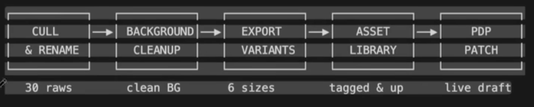
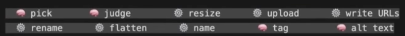

# Example: Product Asset Pipeline

A worked example of the "AI judges, script executes" split described in
[../../foundations/claude-skills/creating-skills.md](../../foundations/claude-skills/creating-skills.md),
applied to processing a batch of product photos.

## The pipeline stages

```
CULL & RENAME → BACKGROUND CLEANUP → EXPORT VARIANTS → ASSET LIBRARY → PDP PATCH
   30 raws          clean BG            6 sizes         tagged & up      live draft
```



## Which steps are AI vs. script at each stage

| Task | Who does it |
|---|---|
| Pick which images are worth keeping | AI (judgment call) |
| Judge whether a background reads as on-brand | AI (judgment call) |
| Resize to the needed variants | Script (deterministic) |
| Upload to the asset library | Script (deterministic) |
| Write asset URLs | Script (deterministic) |
| Rename by convention | Script (deterministic) |
| Flatten the cleaned background | Script (deterministic) |
| Name files | Script (deterministic) |
| Tag assets | AI (judgment call) |
| Write alt text | AI (judgment call) |



The shape holds regardless of the specific pipeline: let AI make the calls
that need judgment (does this look right, what should this be tagged as),
and hand anything mechanical and rule-based to a script so it's fast and
consistent instead of re-litigated by a model every run.
