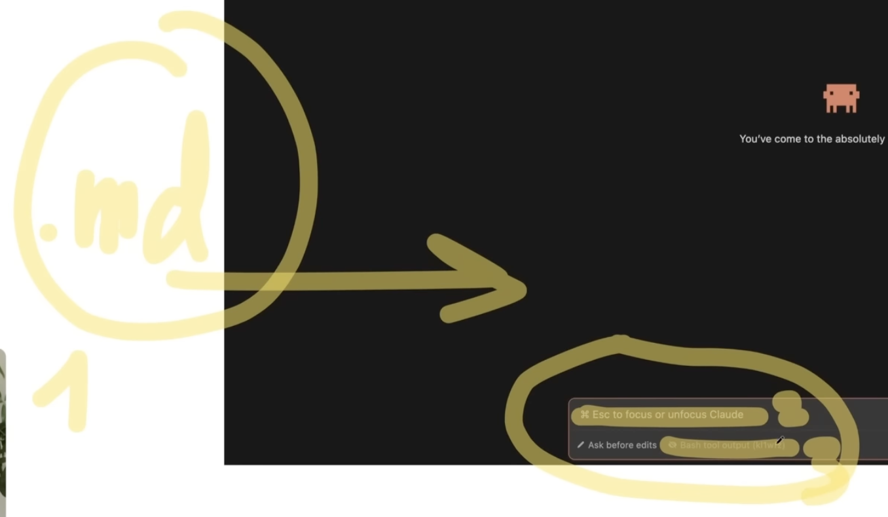

# CLAUDE.md — Structure & Sections

`.md` files (CLAUDE.md and friends) give Claude context before every prompt:
what the project is, why it exists, how to work in it. You can write one by
hand, ask Claude to generate it from your instructions, or download a
template and adapt it.

## Important: this is Claude-specific naming

- `CLAUDE.md` is only read by Claude Code.
- Other agents look for their own filename — e.g. Gemini reads `GEMINI.md`,
  some agent frameworks read `AGENT.md`. You can't just rename the file and
  expect a different agent to pick it up.
- You can ask Claude to translate a CLAUDE.md into another agent's format.

## How multiple CLAUDE.md files interact

```
/main-project-folder
  /claude.md
  /another-folder
    /folder-1
    /folder-2
      /claude.md
```

- By default Claude reads the **highest-level** CLAUDE.md in the project.
- If you're working inside a specific subfolder, Claude reads the CLAUDE.md
  belonging to *that* folder instead (nearest one wins).
- This is how you scope different conventions to different parts of a
  monorepo without one giant file.

## Recommended section layout

A CLAUDE.md that covers a real project tends to land on something like:

| Section | Covers |
|---|---|
| `## Project` | What this thing is, tech stack, repo structure |
| `## Architecture` | How the codebase is organized, key directories, API/data flow, auth approach |
| `## Code Conventions` | Naming patterns, error handling, testing expectations, hard rules ("never use `any`", "zod for validation") |
| `## Design System` | Brand colors & tokens, component library, spacing grid, "no Lorem Ipsum", link out to a `brand-guide.md` for detail |
| `## Content & Tone` | Voice rules, error message style, copy conventions ("sign in" not "log in", no exclamation marks in UI) |
| `## Rules` | Hard constraints the whole team agreed on — e.g. "don't modify auth without asking", "run tests before marking done", "never auto-commit" |

## Ownership pattern (useful once more than one person edits it)

| Engineers | Designers | PM / Product | Shared |
|---|---|---|---|
| Architecture, Code Conventions | Design System | Content & Tone | Project, Rules |

Everyone edits the shared file; each discipline owns its section. Changes
are version-controlled like any other code change.

## When you don't have a project yet

- If you're just drafting ideas, it's fine to start writing/prototyping
  first and ask Claude to generate the CLAUDE.md once patterns emerge.
- If you already have a running project with established rules, write the
  CLAUDE.md up front instead — retrofitting is more work.

See also: [length-and-splitting.md](length-and-splitting.md) for how long is
too long, [what-goes-where.md](what-goes-where.md) for what belongs in the
file vs. what doesn't.


