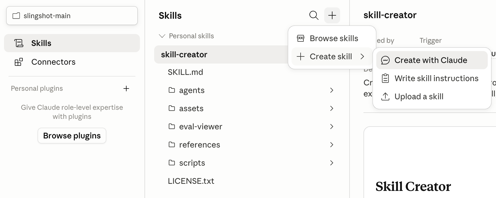

# Claude Skills — Creating & Using Them

## Three ways to create one

- **Create with Claude** — describe the skill conversationally, Claude drafts
  it.
- **Write skill instructions** — write the SKILL.md yourself directly.
- **Upload a skill** — bring in one someone else built.

In practice, the fastest path is usually: use Claude Code itself to write the
skill (open the skill-creator tooling, describe what you want in plain
language, let it scaffold `SKILL.md` + `scripts/` + `references/`).

## AI logic vs. scripts — the core design decision

The most important judgment call when building a skill: what should Claude
*reason about*, and what should be a deterministic script?

- **AI logic** can hallucinate — probabilistic, good for judgment calls.
- **Scripts** give consistent, non-probabilistic output — good for anything
  mechanical or rule-based.

Rule of thumb, in the shape of "AI does X, script does Y":

- AI picks which images matter → script renames them by naming convention.
- AI judges whether a background is on-brand → script flattens it.
- AI picks a focal point in an image → script resizes and names the crop.
- Script uploads assets → AI writes the tags.
- Script writes the URLs → AI writes the alt text.

The pattern behind this: **Instructions (human) → Orchestration (AI) →
Execution (AI or script)** — rather than the simpler but less reliable
Instructions → Execution done entirely by one probabilistic model call. See
[../../applications/design/asset-pipeline-example.md](../../applications/design/asset-pipeline-example.md)
for a worked example of this pattern applied to a real asset pipeline.

See [Anthropic's list of official skills](https://github.com/anthropics/skills/tree/main/skills)
for ready-made examples, including the
[skill-creator](https://github.com/anthropics/skills/blob/main/skills/skill-creator/SKILL.md)
tool referenced below.

## Building your first skill — a minimal recipe

1. Install the skill-creator tooling (Anthropic's skill creator from GitHub,
   linked above).
2. If the skill needs to read a website, install
   [Playwright CLI](https://playwright.dev/agent-cli/installation) (prefer
   this over a generic browser MCP for scripted, repeatable page walks).
3. Write the brief in plain language, e.g.:
   > "Whenever I run this skill, look at [companies/industry], read their
   > website and materials, and return their color scheme — primary,
   > secondary, tertiary, and CTA colors as hex codes. Take a screenshot of
   > the homepage for context on proportions. Output a report as an `.md`
   > file."
4. Iterate by running it against a real example and correcting behavior.

## Managing skills over time

- Build separate skill "profiles" for different hats you wear (e.g.
  researcher vs. UX designer) rather than one skill trying to do everything.
- Disable/archive skills you're not actively using — see
  [skill-architecture.md](skill-architecture.md) for why (context window
  cost).

## Running a skill on a schedule

[Claude Code Schedule Tasks](https://code.claude.com/docs/en/scheduled-tasks)
runs a prompt (including one that triggers a specific skill) on a recurring
schedule, instead of you invoking it manually each time.
