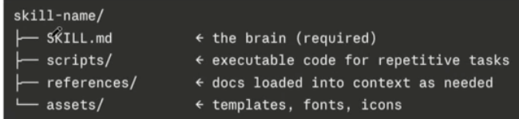
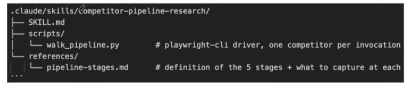
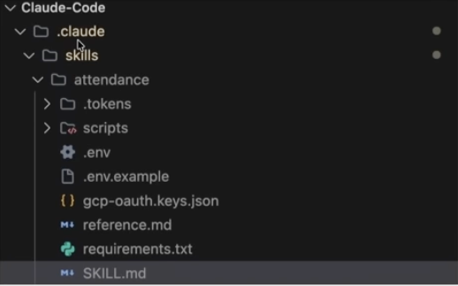

# Claude Skills — Architecture

A **Skill** is the "instructions" layer — a packaged, reusable capability
Claude can load when relevant, instead of you re-explaining a workflow every
time.

## Folder anatomy

```
skill-name/
├── SKILL.md      ← the brain (required)
├── scripts/      ← executable code for repetitive/deterministic tasks
├── references/   ← docs loaded into context only when needed
└── assets/       ← templates, fonts, icons
```



`scripts/`, `references/`, and `assets/` are the parts people forget about
when they talk about "skills" — most of the value beyond a single SKILL.md
prompt lives in these.

### Real example: a research skill

```
.claude/skills/competitor-pipeline-research/
├── SKILL.md
├── scripts/
│   └── walk_pipeline.py     # playwright-cli driver, one competitor per invocation
└── references/
    └── pipeline-stages.md   # definition of the 5 stages + what to capture at each
```



## Where skills live on disk

Skills live in a hidden folder Claude Code creates on your machine
(`~/.claude/skills/` or a per-project `.claude/skills/`). To see them in
Finder: **Cmd+Opt+.** to reveal hidden files.

A real skill folder can also contain runtime files that don't ship with the
skill itself — e.g. `.env` (API keys — **never commit these**), `.env.example`,
OAuth key files, `requirements.txt`. Treat anything under a skill's folder
the same way you'd treat any other code folder: secrets go in `.env`, `.env`
goes in `.gitignore`.



## Practical notes

- Skills are interoperable — designed to be readable by other AI agents, not
  just Claude.
- **Delete or archive skills you're not using.** The first section of a
  skill's YAML frontmatter is consumed by the context window at the start of
  every new chat, whether or not you use it that session — unused skills are
  pure overhead.
- If you're unsure whether Claude's judgment on a task is reliable enough to
  automate fully, design the skill so it produces a **list a human reviews**,
  rather than letting it act autonomously end to end.

See [creating-skills.md](creating-skills.md) for how to actually build one.
